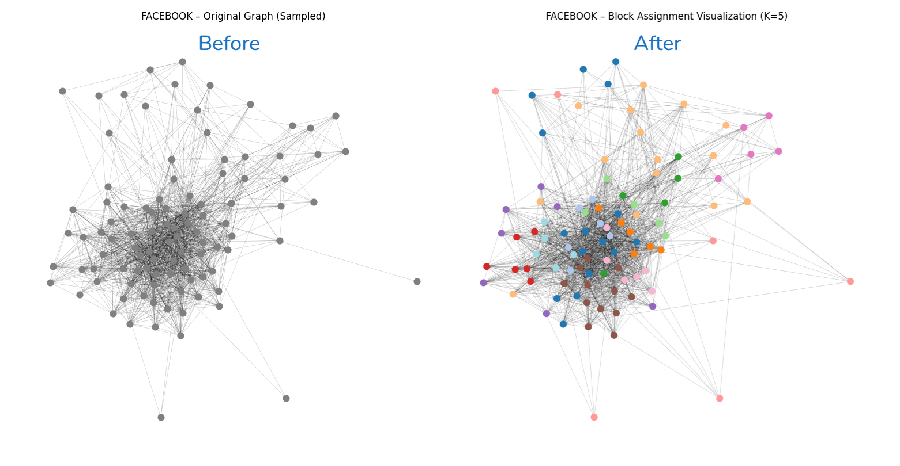

# Machine Learning for Privacy-Preserving Network Representations

This Bachelor project adapts **Stochastic Block Models (SBMs)** to enforce **K-Anonymity** in social networks. It anonymizes graphs by clustering nodes into indistinguishable blocks while preserving key structural properties such as:

- Degree distribution  
- Clustering coefficient  
- Modularity
- Assortativity 
- Shortest path lengths
- Spectral eigenvalues  

#### Original vs Anonymized Graph (Hybrid, K=5)


---

## Contributor

- **Henrik Thorbjørn Holmen** – Project author, developer - [GitHub](https://github.com/HenrikHolmen)

## Supervisors

- **Morten Mørup** – Guidance on methodology, evaluation, and experimental setup
- **Lasse Mohr** – Assistance with evaluation and implementation

For academic inquiries, please contact **s210659@student.dtu.dk** or visit **The Technical University of Denmark** [website](https://www.dtu.dk/english/).

## Project Repository
[GitHub Link](https://github.com/HenrikHolmen/Machine-Learning-For-Privacy-Preserving-Network-Representations)

## Repository Structure

The following describes the organization of this repository:

```
Machine-Learning-For-Privacy-Preserving-Network-Representations/
│
├── code/                         # Source code for model training and anonymization
│   ├── anonymization/           # Merge, Swap, Hybrid anonymization algorithms + utils
│   ├── evaluation/              # Metric functions for utility evaluation
│   └── real_data/               # Dataset loading, processing, and sampling utilities
│       ├── datasets/            # Raw network data (ca-HepTh, Enron, Facebook)
│       ├── processed/           # Placeholder for preprocessed data (unused)
│       └── sampling/            # Forest fire sampling method
│
├── data/
│   ├── real/                    # Sampled subgraphs from real-world datasets
│   │   ├── ca-hepth/
│   │   ├── enron/
│   │   └── facebook/
│   ├── synthetic/               # Synthetic SBM networks and true z-assignments
│   └── results/                 # Outputs from anonymization experiments
│       ├── real/                # Real data results per dataset
│       ├── synthetic/           # Synthetic results grouped by algorithm
│       ├── metrics/             # JSON utility scores
│       ├── plots/               # Visual output of graphs and distributions
│       ├── graphs/              # Sampled adjacency matrices
│       ├── traces/              # Log-likelihood traces for Swap/Hybrid/Merge
│       └── z_vectors/           # Final z_anonymized files
│
├── notebooks/                   # All Jupyter notebooks for evaluation and plotting
│
├── requirements.txt             # Python environment dependencies
├── README.md                    # This file
└── .gitignore                   # Specifies files to exclude from version control

```

## How to Use This Repository

This repository contains the implementation of privacy-preserving network representations using machine learning techniques. 
To use it:

1. Clone the repository
```bash
git clone https://github.com/HenrikHolmen/Machine-Learning-For-Privacy-Preserving-Network-Representations.git
cd Machine-Learning-For-Privacy-Preserving-Network-Representations
```

2. Set up the environment
```bash
pip install -r requirements.txt
```

> Tested on Python 3.10+  
> Compatible with Windows, macOS, and Linux  
> Recommended: Use a virtual environment (`venv` or `conda`)

##  Run Experiments

### Real Data Anonymization

```bash
python code/main_merge_real.py       # Merge algorithm
python code/main_swap_real.py        # Swap algorithm
python code/main_hybrid_real.py      # Hybrid algorithm
```

### Evaluate Results

```bash
jupyter notebooks/evaluation_runner_real.ipynb
```

--- 

## Sampling Strategy
I use the **Forest Fire sampling algorithm** to extract subgraphs (e.g., n=100, 200, 400) from large real-world graphs.  
This retains realistic local structure for evaluation.

Modify `code/real_data/sampling/forest_fire.py` to change size or randomness.

---

## Synthetic Graph Generation

Generate synthetic SBM-based graphs to evaluate K-anonymity performance on ground truth community structures:

```bash
python code/synthetic_generator.py
```

--- 

## Notes

- Output plots, metrics, and logs are stored in `data/results/`
- To avoid version control clutter, raw outputs are excluded via `.gitignore`
- JSON utility scores are retained for post-analysis (`data/results/metrics/`)


### Questions?

Feel free to [open an issue](https://github.com/HenrikHolmen/Machine-Learning-For-Privacy-Preserving-Network-Representations/issues)

### Datasets

The following datasets were used in this project, all sourced from the SNAP repository:

- [Enron Email Network](https://snap.stanford.edu/data/email-Enron.html)
- [CA-HepTh Collaboration Network](https://snap.stanford.edu/data/ca-HepTh.html)
- [Facebook Ego-Networks](https://snap.stanford.edu/data/ego-Facebook.html)